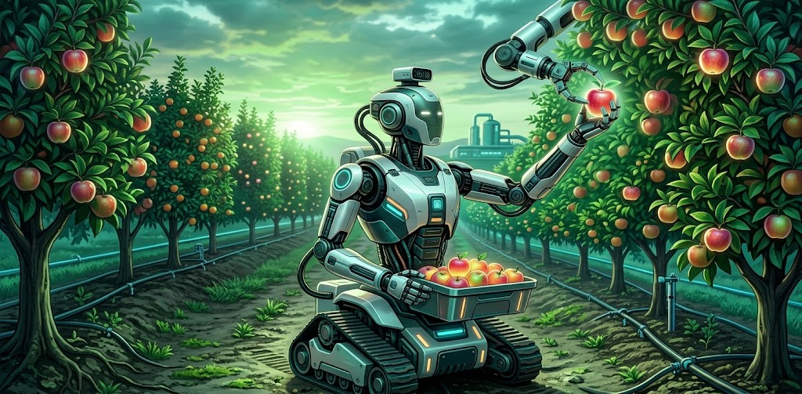
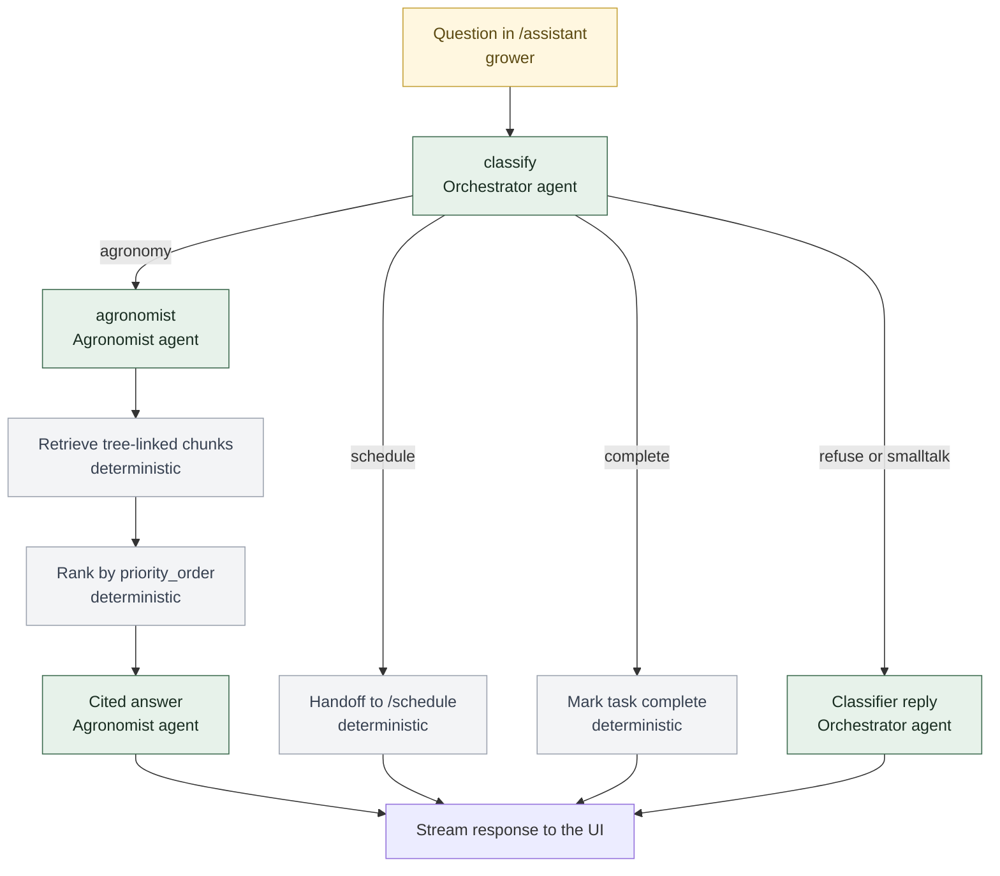
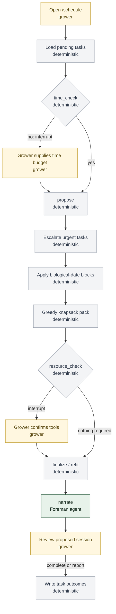
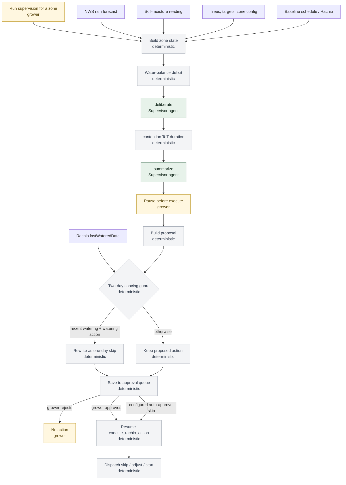

# Orchard Assistant

<p align="center">
  
</p>

**Grounded horticulture chat, JIT labor packing, and water-saving irrigation supervision with human approval.**

Public repo: [github.com/Erbene/orchard-assistant](https://github.com/Erbene/orchard-assistant)

---

## The problem

A home grower with mixed tropical and subtropical species faces three recurring pressures:

- **Automatic irrigation can run up significant bills** when schedules ignore soil moisture, rain, and species-specific water needs.
- **Weekend labor is scarce** — pruning, fertilizing, and pest checks compete for the same few hours.
- **Horticulture advice must be grounded** in the grower's own notes and linked sources, not generic LLM guesses.

Orchard Assistant is a personal assistant for that grower: three LangGraph workflows over a real orchard inventory, knowledge base, and Rachio zones.

---

## What ships

| Workflow | UI | What it does |
| -------- | -- | ------------ |
| **Grounded chat** | `/assistant` | Routes questions to cited agronomy answers (Chroma RAG) or hands off to scheduling. Refuses unsafe or off-topic requests. |
| **JIT labor packing** | `/schedule` | Foreman negotiates available minutes and tools, escalates time-critical tasks, and packs a knapsack plan — nothing writes to the task DB until you confirm. |
| **Irrigation supervision** | `/irrigation` | Supervisor reads weather and moisture, runs a Tree-of-Thoughts zone-duration solver, and pauses before execution. Watering/pass proposals require approval; skips may be configured for auto-approval. |

Supporting surfaces: `/trees` and `/trees/[id]` (CRUD + Care Plan tab), `/sources` (knowledge-base upload and tree linking), `/zones` (live Rachio zone list).

Deep API docs, agent prompts, and eval log: **[orchard-server/README.md](orchard-server/README.md)**.

---

## Workflow architecture

Second line is the owner: **agent** (green), **deterministic** Python (gray), or **grower** (gold). Data sources are unlabeled.

### 1. Orchestrator — grounded chat



Every turn makes one classification call. Only the agronomy branch adds retrieval and a second LLM call; scheduling is handed to the Foreman rather than performed in chat.

### 2. Foreman — JIT labor planning



Escalation, date rules, packing, and refitting are deterministic Python. The checkpointed graph can pause for time and tool answers; planning itself does not modify task records. The Foreman agent only writes the session summary (template fallback if Ollama is down).

### 3. Irrigation Supervisor — proposal and approval



The solver evaluates every zone, including mixed-species contention. Every action pauses before execution; approved supervisor actions are currently `dry_run`. The separate `/zones` manual-water control is a live Rachio write and bypasses this workflow.

---

## Design principle

| Layer | Owns |
| ----- | ---- |
| **LLM (Ollama)** | Intent routing, cited prose, negotiation narration, plan summaries |
| **Deterministic Python** | Water balance, duration beam search, two-day irrigation gap, biological calendar dates, escalation weights, knapsack packing |
| **Grower** | Available time, tools on hand, source priority order, and irrigation approval |

---

## Quickstart (Windows)

**Prerequisites:** Docker Desktop, [Ollama](https://ollama.com) for local inference.

```powershell
cd orchard-server
python -m venv .venv
.venv\Scripts\python -m pip install -r requirements.txt
copy .env.example .env          # review local password; Rachio and orchard coordinates are optional

cd ..\orchard-web
npm install

ollama serve
ollama pull qwen2.5:7b-instruct

cd ..
.\dev.ps1                       # bare-metal app + containerised Postgres/Chroma
.\dev.ps1 -Demo                 # optional: irrigation demo scenarios on /irrigation/sensors
```

**Full stack in Docker** (Postgres, Chroma, backend, frontend):

```powershell
docker compose -f orchard-server/docker-compose.yml up -d --build
```

**Ports** (bound to `127.0.0.1`): UI **3000**, API **8000** (`/docs`), Postgres **5433**, Chroma **8001**, Ollama **11434**.

Optional LangSmith tracing for irrigation: set `LANGCHAIN_TRACING_V2=true` and `LANGCHAIN_API_KEY` in `orchard-server/.env`.

---

## Demo walkthrough

After `.\dev.ps1 -Demo` (or `ORCHARD_DEMO=true`):

1. **`/assistant`** — Ask a species-specific care question with linked sources; confirm citations. Ask to plan weekend work; follow the schedule handoff redirect.
2. **`/schedule`** — Enter available minutes and tools; walk the Foreman interrupts; inspect the packed plan before completing.
3. **`/irrigation/sensors`** — Pin stub readings (moisture, rain, QPF, last-watered) for a known outcome, or apply a preset via API (e.g. `POST /api/v1/irrigation/demo/mixed-zone-tot/apply` for **Mixed zone: mango vs. a thirsty neighbour**). Then click **Run Supervision Task** on the irrigation header. Inspect the HITL queue at **`/irrigation`** (duration change, per-species projected VWC, Approve/Reject). With LangSmith enabled, open the `irrigation.tot_solver` trace to see beam-search candidates.

Other demo presets (API): `rain-skip` (skip schedule after heavy QPF), `drought-emergency` (emergency run proposal).

---

## Routes & capabilities

| Route | Purpose |
| ----- | ------- |
| `/assistant` | Grounded chat (Orchestrator + Ollama SSE) |
| `/schedule` | Task inbox + Foreman JIT dialog |
| `/irrigation` | Supervisor HITL approval queue |
| `/irrigation/sensors` | Sensor readings; demo moisture/rain pins when `ORCHARD_DEMO=true` |
| `/irrigation/schedule` | Rachio zone schedule + supervisor settings |
| `/trees`, `/trees/[id]` | Tree CRUD, Care Plan tab, linked sources |
| `/zones` | Rachio zones (read-only list; **manual water is a real Rachio write**) |
| `/sources` | Knowledge-base upload, compose, and tree linking |

MCP endpoint (when backend is running): `http://127.0.0.1:8000/mcp/sse`.

---

## Tests & evaluation

```powershell
cd orchard-server
.venv\Scripts\python -m pytest
.venv\Scripts\python -m eval          # needs Ollama; see orchard-server/eval/README.md
```

Eval harness details: **[orchard-server/eval/README.md](orchard-server/eval/README.md)**.

| Channel | Exact gate | Notes |
| ------- | ---------- | ----- |
| Full dataset (25 chat + 12 schedule + 12 irrigation) | **49/49** | 2026-09-05: GPU (`100% GPU`, 110 s) and CPU-32 (`100% CPU`, 1177 s) |
| Advisory judge (GPU run) | not a gate | 29/38 overall, 4/12 irrigation prose, 21/21 grounded agronomy claims |

**2026-09-05 role benchmark** (Ryzen 9 5950X + RTX 3070 Ti): Qwen2.5 7B is the production model for every agent. It was the only candidate to pass every exact role suite; 14B, Qwen3 8B, and Gemma 3 4B added regressions or latency without a quality gain. See `orchard-server/eval/baselines/2026-09-05-role-benchmark.md`.

---

## Safety & limitations

Read these before connecting a live Rachio account.

- **Supervisor Approve is `dry_run`** — proposals queue for HITL, but approved actuation does not call Rachio's live start endpoint in the current build.
- **Moisture is stubbed** — demo pins and synthetic readings; no soil-sensor hardware integration.
- **`/zones` manual watering bypasses HITL** — it performs a real Rachio write outside the supervisor queue.
- **Weather unavailable** when `ORCHARD_LAT` / `ORCHARD_LON` are unset (`available: false`).
- **Not shipped:** frost watch, camera/vision agent, CrewAI orchestration, four-tier RAG fusion.
- **Not licensed agronomic advice** — a decision-support tool for a single grower's orchard; verify critical actions independently.

---

## Repository map

```
orchard-assistant/
├── dev.ps1                 # Windows dev launcher (Postgres/Chroma + backend + frontend)
├── dev.sh                  # Linux/macOS equivalent
├── orchard-server/         # FastAPI, LangGraph agents, irrigation engine, eval harness
│   ├── app/agent/          Orchestrator, Foreman, Irrigation Supervisor graphs
│   ├── app/irrigation/     Water balance, ToT solver, phenology, weather, demo pins
│   ├── eval/               Offline scored scenarios (chat, schedule, irrigation)
│   └── docker-compose.yml  Postgres, Chroma, optional full-stack containers
└── orchard-web/            # Next.js UI (assistant, schedule, irrigation, trees, sources)
```

Local-only folders (`docs/`, `future_work/`, `capstone_submissions/`) are gitignored and not in the public repo.

---

## Design evolution

Early capstone concepts centered on frost protection for a single crop. In practice, frost is rare in this climate; **poorly tuned automatic irrigation is the recurring cost risk**. The shipped system repurposed that supervision pattern for water-saving Rachio control and added JIT labor packing for scarce weekend time.

Implementation diverged from early write-ups: **LangGraph** (not CrewAI), **Chroma + `priority_order` RAG** (not four-tier fusion), and **Tree-of-Thoughts for zone duration** (not task planning). Readers do not need prior submission context — the code and eval baselines above reflect what runs today.
