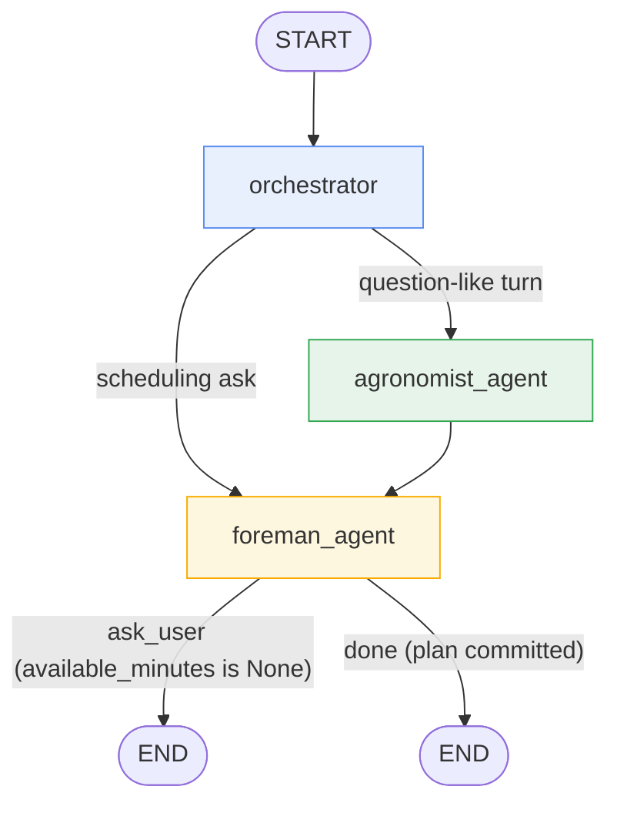

# `app/agent` — LangGraph orchestration skeleton

The conversational brain for the orchard's **Just-In-Time (JIT) scheduler**.
Today it is a **skeleton**: a real, compiling `StateGraph` with the control
flow, state shape, the JIT multi-turn interrupt, and MCP tool binding all in
place — but the nodes are deterministic stubs, not LLM calls. This mirrors the
rest of the project's "wire the plumbing first, drop the model in later"
stance (see `app/services/chat_service.py`, also a stub).

```
app/agent/
├── __init__.py   exports `build_graph`, `AgentState`
├── state.py      AgentState — the TypedDict threaded through every node
├── graph.py      nodes, routing functions, graph assembly (+ compiled `graph`)
└── client.py     binds the orchard MCP server's tools as LangChain tools
```

---

## Purpose

The user talks to the assistant; the assistant has to do two very different
kinds of work, so the graph splits into two specialists:

| Specialist | Job | Grounded by |
| ---------- | --- | ----------- |
| **Agronomist** | Answer horticultural questions ("why are the leaves yellowing?", "when do I prune a young mango?") | `search_ag_knowledge` MCP tool → Consensus-Fusion RAG over the sources linked to the active tree |
| **Foreman** | Turn the pending-task backlog into a plan for *this* work session | `get_pending_tasks` / `batch_update_task_priorities` MCP tools |

**Why "Just-In-Time".** The system does **not** store a labour budget or an
equipment list (the old `user_context` table was dropped). Instead the Foreman
gathers those constraints *in the conversation, at the moment of scheduling* —
"how many minutes do you have right now?", "do you have the copper spray on
hand?". Task specs already carry `estimated_minutes` and `required_resources`
(the LLM fills these in via `create_task` / `create_baseline_tasks`), so the
Foreman only needs the live numbers to compute a fit.

That "ask, then continue once answered" behaviour is the **JIT multi-turn
interrupt** and it is the one piece of real logic in the skeleton.

---

## `AgentState` (`state.py`)

A `TypedDict` — LangGraph merges each node's returned dict into it.

| Field | Type | Reducer | Meaning |
| ----- | ---- | ------- | ------- |
| `messages` | `list[BaseMessage]` | `add_messages` | The running transcript. `add_messages` **appends** (and de-dupes by id / applies updates), so a node returns only its *new* messages. |
| `active_tree_id` | `int \| None` | last-write | Which tree the conversation is about. The Agronomist scopes RAG to it; `None` until the user names a tree. |
| `available_minutes` | `int \| None` | last-write | Minutes of work the user has **right now**. `None` ⇒ unknown ⇒ the Foreman must ask before it can schedule. |
| `confirmed_resources` | `list[str]` | last-write | Products / tools the user has confirmed are on hand this session. Tasks whose `required_resources` aren't covered get deferred. |

Routing is derived **from these fields and the messages** — no extra
"route"/"intent" keys are stashed in state. That keeps `AgentState` to exactly
the four fields the design calls for and keeps the reducers predictable.

---

## The graph (`graph.py`)



Plain-text form:

```
START
  └─▶ orchestrator ──route_from_orchestrator──┬─▶ agronomist_agent ──▶ foreman_agent ─┐
                                              └─────────────────────▶ foreman_agent ──┤
                                                                                      │
                          route_from_foreman:  available_minutes is None ? ask_user   │
                                               else                        done       │
                                                                            │         │
                                                                            └──▶ END ◀─┘
```

### Nodes

| Node | Sync/async | Stub behaviour | Real behaviour (documented inline) |
| ---- | ---------- | -------------- | ---------------------------------- |
| `orchestrator` | sync | Emits a `[orchestrator] routing…` marker message. | LLM reads `messages`, classifies the turn, extracts `active_tree_id`. |
| `agronomist_agent` | async | Emits a stub message describing what it *would* do. | LLM bound to `search_ag_knowledge`; calls it with `active_tree_id` + the question, fuses the per-`--- SOURCE n ---` blocks, drafts an answer. |
| `foreman_agent` | async | **Real JIT check** (below); otherwise a stub "would fit ~N min" message. | LLM: pull `get_pending_tasks`, fit `available_minutes` / `confirmed_resources`, commit via `batch_update_task_priorities`. |

Every node returns `{"messages": [AIMessage(..., name="<node>")]}` — the
`name` makes the transcript legible and lets tests assert the path taken.

### Edges & routing

| From | To | Kind | Decider |
| ---- | -- | ---- | ------- |
| `START` | `orchestrator` | direct | — |
| `orchestrator` | `agronomist` **or** `foreman` | conditional | `route_from_orchestrator` |
| `agronomist` | `foreman` | direct | — (an answer can still lead into "…so what should I do about it today?") |
| `foreman` | `END` | conditional | `route_from_foreman` (`ask_user` / `done` — both currently terminate) |

`route_from_orchestrator(state)` — a keyword heuristic on the **last human
message**: if it contains any of `why / how / what / when / disease / pest /
deficien` it goes to the Agronomist, otherwise straight to the Foreman. (The
real orchestrator LLM replaces this heuristic; the routing function then just
reads whatever signal the orchestrator wrote.)

`route_from_foreman(state)` — returns `ask_user` when
`available_minutes is None`, else `done`. Both map to `END` today; `ask_user`
is named separately because it is the **JIT pause point**.

### The JIT multi-turn interrupt

Inside `foreman_agent`:

```python
if state.get("available_minutes") is None:
    return {"messages": [AIMessage(
        "How many minutes do you have to work in the orchard right now?",
        name="foreman",
    )]}
# ...otherwise: fetch backlog, fit, commit
```

The run then ends (`route_from_foreman → ask_user → END`). The **caller** is
responsible for the multi-turn loop: when the user replies "about 90 minutes",
the caller parses it, sets `available_minutes = 90` in the state, appends the
user's `HumanMessage`, and **re-invokes the graph**. This time the Foreman
falls through to the scheduling branch.

> A production version would more likely use LangGraph's `interrupt()` plus a
> checkpointer (`MemorySaver`, or `SqliteSaver` pointed at the same DB) so the
> graph pauses *in place* and resumes on `Command(resume=...)` without the
> caller reconstructing state. The skeleton uses the simpler
> "end-and-re-invoke" pattern to stay dependency-light and obvious.

### Running it

`graph.py` compiles a module-level singleton: `from app.agent.graph import graph`.

```python
import asyncio
from langchain_core.messages import HumanMessage
from app.agent.graph import graph

# Turn 1 — no time budget yet → the Foreman asks
s1 = asyncio.run(graph.ainvoke({
    "messages": [HumanMessage("plan my orchard work")],
    "active_tree_id": None,
    "available_minutes": None,
    "confirmed_resources": [],
}))
print(s1["messages"][-1].content)
# -> "How many minutes do you have to work in the orchard right now?"

# Turn 2 — caller merges the answer into state and re-invokes
s2 = asyncio.run(graph.ainvoke({
    "messages": s1["messages"] + [HumanMessage("about 90 minutes")],
    "active_tree_id": 1,
    "available_minutes": 90,
    "confirmed_resources": ["sprayer"],
}))
print(s2["messages"][-1].content)
# -> "[foreman] (stub) would pull get_pending_tasks, fit ~90 min ..."
```

Covered by `tests/test_agent.py` (3 tests: Foreman asks for the budget,
Foreman proceeds once it's known, a question routes through the Agronomist).

---

## `client.py` — MCP tool binding

The agent does **not** re-implement data access. It reuses the orchard **MCP
server** (`app/mcp_server.py`), exposing every tool — `list_trees`,
`get_pending_tasks`, `batch_update_task_priorities`, `search_ag_knowledge`, … —
as LangChain `BaseTool`s via `langchain-mcp-adapters`:

```python
from app.agent.client import load_orchard_tools

tools = await load_orchard_tools()          # stdio: spawns `python -m app.mcp_server`
tools = await load_orchard_tools(use_sse=True)   # sse: connects to a running :8000/mcp/sse
```

- **`_STDIO`** (default) — `MultiServerMCPClient` starts a fresh
  `python -m app.mcp_server` subprocess per client. Self-contained; no server
  needs to be up. Same code path to SQLite as the REST API.
- **`_SSE`** — points at `http://127.0.0.1:8000/mcp/sse` (the FastMCP app
  mounted on the running FastAPI server). Use this when the API is already
  running so you don't spawn a second process.

Once a real model is added, a node does:

```python
from langgraph.prebuilt import ToolNode
from langchain.chat_models import init_chat_model

tools = await load_orchard_tools()
llm   = init_chat_model("...").bind_tools(tools)
# node: llm.ainvoke(state["messages"]) ; ToolNode(tools) executes any tool calls
```

---

## LangSmith tracing

Set these (see `orchard-server/.env.example`) and every `graph.ainvoke` shows
up as a trace tree in [smith.langchain.com](https://smith.langchain.com):

```
LANGCHAIN_TRACING_V2=true
LANGCHAIN_ENDPOINT=https://api.smith.langchain.com
LANGCHAIN_API_KEY=lsv2_pt_...
LANGCHAIN_PROJECT=orchard-agent
```

---

## Turning the skeleton into the real thing

1. **`orchestrator`** — swap the marker message for an LLM classification;
   have it write `active_tree_id` and a routing hint into state (add the field
   to `AgentState`), then simplify `route_from_orchestrator` to read it.
2. **`agronomist_agent`** — `load_orchard_tools()`, bind to the model, let it
   call `search_ag_knowledge(tree_id=active_tree_id, query=…)` and reason over
   the fused source blocks.
3. **`foreman_agent`** — keep the `available_minutes is None` guard; below it,
   pull `get_pending_tasks`, ask the model to select/re-order tasks that fit
   the minutes and `confirmed_resources`, and commit with
   `batch_update_task_priorities`.
4. **Persistence** — compile with a checkpointer and switch the JIT pause to
   `interrupt()` so multi-turn conversations survive without the caller
   rebuilding state.
5. **Entry point** — expose the graph over HTTP (e.g. from
   `app/api/routes/chat.py`, replacing the stub `ChatService`) or as a LangGraph
   Platform deployment.
